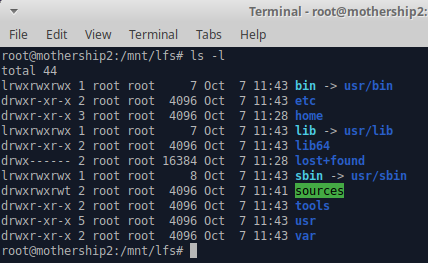
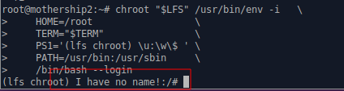
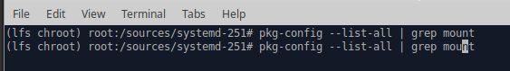

# Linux From Scratch F22

[TOC]

## Resources

* [Version 11.2 (systemd)](https://www.linuxfromscratch.org/lfs/view/stable-systemd/)

## Tweaks

### Going back to chroot after a failure

* As root user

  ```bash
  mount -v --bind /dev $LFS/dev
  mount -v --bind /dev/pts $LFS/dev/pts
  mount -vt proc proc $LFS/proc
  mount -vt sysfs sysfs $LFS/sys
  mount -vt tmpfs tmpfs $LFS/run
  
  if [ -h $LFS/dev/shm ]; then
    mkdir -pv $LFS/$(readlink $LFS/dev/shm)
  fi
  
  chroot "$LFS" /usr/bin/env -i   \
      HOME=/root                  \
      TERM="$TERM"                \
      PS1='(lfs chroot) \u:\w\$ ' \
      PATH=/usr/bin:/usr/sbin     \
      /bin/bash --login
  ```

  

  

## Preparing the Build

### Build Environment

* Pop 22.04 LTS on Dell Latitude

* VMWare Workstation 16 Pro

  

* Mothership

  *  

  * 8GiB RAM

  * 2 - 30Gib Disks (Thin)

    * Second Disk is called ```lfs.vmdk```

  * Display, disable 3D Acceleration, it causes random issues with VMWare Workstation Pro.

     

  * BIOS Boot
  
     
  
  * Install OS on /dev/sda

### version-check.sh

```bash
sudo apt upgrade
sudo apt install openssh-server
mkdir ~/lfs
```

> come in over ssh from host machine

 

```bash
sudo apt-get install g++ texinfo gawk m4 make bison
sudo ln -sf bash /bin/sh
```

> A clear version check after installing dependencies

 

> :camera: Base, take a powered down snapshot before progressing.

## Partitioning Scheme

> /dev/sdb needs to be partitioned

 

```bash
sudo -i
cfdisk /dev/sdb
```

 


 

```bash
mkfs.ext2 /dev/sdb2 -L LFSBOOT
mkfs.ext4 /dev/sdb3 -L LFSROOT
mkfs.ext4 /dev/sdb4 -L LFSHOME
mkswap /dev/sdb5
lsblk -f /dev/sdb
```

 

> :camera: /dev/sdb partitioned

## Setting $LFS (2.6)

* As a normal user

```bash
exit
echo "export LFS=/mnt/lfs" >> ~/.bashrc
source ~/.bashrc
echo $LFS
```

* Do the same thing as the root user.

  

## Mounting LFS manually (2.7)

```bash
sudo -i
mkdir -pv $LFS
mount -v -t ext4 /dev/sdb3 $LFS
mkdir -v $LFS/home
mount -v -t ext4 /dev/sdb4 $LFS/home
swapon /dev/sdb5
```

 

## Mount on Reboot

```/etc/fstab```

```
/dev/sdb3  /mnt/lfs ext4   defaults      1     1
/dev/sdb4  /mnt/lfs/home ext4   defaults      1     1
```

 

```bash
reboot
lsblk
```

 

> :checkered_flag:Milestone 1

## Chapter 3 Packages and Patches using wget-list-systemd

```bash
sudo -i
mkdir -v $LFS/sources
chmod -v a+wt $LFS/sources
exit
cd $LFS/sources
wget https://www.linuxfromscratch.org/lfs/view/stable-systemd/wget-list-systemd
wget --input-file=wget-list-systemd --continue --directory-prefix=$LFS/sources
du -h
wget https://www.linuxfromscratch.org/lfs/view/stable-systemd/md5sums
pushd $LFS/sources
  md5sum -c md5sums
popd
```

 

### Manual download

> Some downloads may fail or in the case of expat and python3, the errata indicates a security vulnerability.

https://sourceforge.net/projects/expat/files/expat/2.4.9/expat-2.4.9.tar.xz/download (Note, the previous one is labeled vulnerable, so let's go with this one.)  Later, when we compile, we will need to reference the 2.4.9 version.

Python and Python docs need to be updated as well to the next release

https://www.linuxfromscratch.org/lfs/advisories/11.2.html

### Clean Run

 


## Chapter 4 - Directory Structure for LFS File System (4.2)

```bash
sudo -i
mkdir -pv $LFS/{etc,var} $LFS/usr/{bin,lib,sbin}

for i in bin lib sbin; do
  ln -sv usr/$i $LFS/$i
done

case $(uname -m) in
  x86_64) mkdir -pv $LFS/lib64 ;;
esac
mkdir -pv $LFS/tools
```

 

> :camera: Take a powered off snapshot called Milestone 1.

## LFS User

```bash
sudo -i
groupadd lfs
useradd -s /bin/bash -g lfs -m -k /dev/null lfs
passwd lfs
```

### permissions

```basdh
chown -v lfs $LFS/{usr{,/*},lib,var,etc,bin,sbin,tools}
case $(uname -m) in
  x86_64) chown -v lfs $LFS/lib64 ;;
esac
```

### switch user

```bash
su - lfs
```

### bash_profile

```
cat > ~/.bash_profile << "EOF"
exec env -i HOME=$HOME TERM=$TERM PS1='\u:\w\$ ' /bin/bash
EOF
```

### bashrc

```bash
cat > ~/.bashrc << "EOF"
set +h
umask 022
LFS=/mnt/lfs
LC_ALL=POSIX
LFS_TGT=$(uname -m)-lfs-linux-gnu
PATH=/usr/bin
if [ ! -L /bin ]; then PATH=/bin:$PATH; fi
PATH=$LFS/tools/bin:$PATH
CONFIG_SITE=$LFS/usr/share/config.site
export LFS LC_ALL LFS_TGT PATH CONFIG_SITE
EOF
```

> getting rid of /etc/bashrc

```bash
[ ! -e /etc/bash.bashrc ] || mv -v /etc/bash.bashrc /etc/bash.bashrc.NOUSE
```

> go back to lfs

```bash
su - lfs
source ~/.bash_profile
echo $LFS
```

 

## Chapter 5 - Part 3 -Tool Chain and Temporary Tools 

### 5.2 Binutils Pass 1

 

```bash
cd $LFS/sources/
tar xf binutils-2.39.tar.xz 
cd binutils-2.39
mkdir -v build
cd build

time { ../configure --prefix=$LFS/tools --with-sysroot=$LFS --target=$LFS_TGT --disable-nls --enable-gprofng=no --disable-werror && make && make install; }
```

> 1 SBU on mothership2 is 2m23s

 

>  So a 12 SBU GCC is likely to take 25-30 minutes or so to configure, make and install.

### 5.3.1 GCC-12.2.0 - Pass 1 (5.3.1)

```bash
cd /mnt/lfs/sources/
tar xf gcc-12.2.0.tar.xz
cd cd gcc-12.2.0
tar -xf ../mpfr-4.1.0.tar.xz
mv -v mpfr-4.1.0 mpfr
tar -xf ../gmp-6.2.1.tar.xz
mv -v gmp-6.2.1 gmp
tar -xf ../mpc-1.2.1.tar.gz
mv -v mpc-1.2.1 mpc
```

```bash
case $(uname -m) in
  x86_64)
    sed -e '/m64=/s/lib64/lib/' \
        -i.orig gcc/config/i386/t-linux64
 ;;
esac
```

```bash
mkdir -v build
cd build

../configure                  \
    --target=$LFS_TGT         \
    --prefix=$LFS/tools       \
    --with-glibc-version=2.36 \
    --with-sysroot=$LFS       \
    --with-newlib             \
    --without-headers         \
    --disable-nls             \
    --disable-shared          \
    --disable-multilib        \
    --disable-decimal-float   \
    --disable-threads         \
    --disable-libatomic       \
    --disable-libgomp         \
    --disable-libquadmath     \
    --disable-libssp          \
    --disable-libvtv          \
    --disable-libstdcxx       \
    --enable-languages=c,c++
    
    make; make install
    
cd ..
cat gcc/limitx.h gcc/glimits.h gcc/limity.h > `dirname $($LFS_TGT-gcc -print-libgcc-file-name)`/install-tools/include/limits.h
```

### 5.4. Linux-5.19.2 API Headers

```bash
cd $LFS/source
tar xf linux-5.19.2.tar.xz
cd linux-5.19.2
make mrproper
make headers
find usr/include -type f ! -name '*.h' -delete
cp -rv usr/include $LFS/usr
```

### 5.5. Glibc-2.36

```bash
cd $LFS/sources
tar xf tar xf glibc-2.36.tar.xz 
cd glibc-2.36

case $(uname -m) in
    i?86)   ln -sfv ld-linux.so.2 $LFS/lib/ld-lsb.so.3
    ;;
    x86_64) ln -sfv ../lib/ld-linux-x86-64.so.2 $LFS/lib64
            ln -sfv ../lib/ld-linux-x86-64.so.2 $LFS/lib64/ld-lsb-x86-64.so.3
    ;;
esac

patch -Np1 -i ../glibc-2.36-fhs-1.patch
mkdir build; cd build
echo "rootsbindir=/usr/sbin" > configparms'


../configure                             \
      --prefix=/usr                      \
      --host=$LFS_TGT                    \
      --build=$(../scripts/config.guess) \
      --enable-kernel=3.2                \
      --with-headers=$LFS/usr/include    \
      libc_cv_slibdir=/usr/lib
      
make
make DESTDIR=$LFS install
```

 

```bash
rm a.out
```

```bash
$LFS/tools/libexec/gcc/$LFS_TGT/12.2.0/install-tools/mkheaders
```

### 5.6.1. Installation of Target Libstdc++

```bash
tar xf gcc-12.2.0.tar.xz
cd gcc-12.2.0
mkdir build; cd build

../libstdc++-v3/configure           \
    --host=$LFS_TGT                 \
    --build=$(../config.guess)      \
    --prefix=/usr                   \
    --disable-multilib              \
    --disable-nls                   \
    --disable-libstdcxx-pch         \
    --with-gxx-include-dir=/tools/$LFS_TGT/include/c++/12.2.0
    
 make
 make DESTDIR=$LFS install
 rm -v $LFS/usr/lib/lib{stdc++,stdc++fs,supc++}.la
```

> :checkered_flag:Milestone 2

```bash
cd /mnt/lfs/sources/glibc-2.36
nano milestone2.cpp

```

```c++
#include <iostream>
using namespace std;

int main()
{
  cout << "testing milestone 2" <<  endl;
  return 0;

}
```

```bash
g++ milestone2.cpp -o milestone2
readelf -l milestone2 | grep ld-linux
rm milestone2*
```


 


## Chapter 6. Cross Compiling Temporary Tools

### m4

```bash
tar xf m4-1.4.19.tar.xz
cd m4-1.4.19

./configure --prefix=/usr   \
            --host=$LFS_TGT \
            --build=$(build-aux/config.guess)

make
make DESTDIR=$LFS install

```

### ncurses

```bash
tar xf ncurses-6.3.tar.gz 
```

> Note rebooted here due to some performance issues

```bash
sed -i s/mawk// configure
mkdir build
pushd build
  ../configure
  make -C include
  make -C progs tic
popd
```

```bash
./configure --prefix=/usr                \
            --host=$LFS_TGT              \
            --build=$(./config.guess)    \
            --mandir=/usr/share/man      \
            --with-manpage-format=normal \
            --with-shared                \
            --without-normal             \
            --with-cxx-shared            \
            --without-debug              \
            --without-ada                \
            --disable-stripping          \
            --enable-widec
```

```bash
make
make DESTDIR=$LFS TIC_PATH=$(pwd)/build/progs/tic install
echo "INPUT(-lncursesw)" > $LFS/usr/lib/libncurses.so
```

### 6.4.1. Installation of Bash

```bash
tar xf bash-5.1.16.tar.gz
cd bash-5.1.16

./configure --prefix=/usr                   \
            --build=$(support/config.guess) \
            --host=$LFS_TGT                 \
            --without-bash-malloc

make

make DESTDIR=$LFS install
ln -sv bash $LFS/bin/sh
```

### 6.5.1 coreutils

```bash
tar xf coreutils-9.1.tar.xz 
cd coreutils-9.1
make
make DESTDIR=$LFS install

mv -v $LFS/usr/bin/chroot $LFS/usr/sbin
mkdir -pv $LFS/usr/share/man/man8
mv -v $LFS/usr/share/man/man1/chroot.1 $LFS/usr/share/man/man8/chroot.8
sed -i 's/"1"/"8"/' $LFS/usr/share/man/man8/chroot.8
```

### 6.6. Diffutils-3.8

```bash
tar xf diffutils-3.8.tar.xz 
./configure --prefix=/usr --host=$LFS_TGT
make
make DESTDIR=$LFS install

```

### 6.7. File-5.42

```bash
tar xf file-5.42.tar.gz
file-5.42
mkdir build

pushd build
  ../configure --disable-bzlib      \
               --disable-libseccomp \
               --disable-xzlib      \
               --disable-zlib
  make
popd

./configure --prefix=/usr --host=$LFS_TGT --build=$(./config.guess)
make FILE_COMPILE=$(pwd)/build/src/file
make DESTDIR=$LFS install
```
### 6.8 findutils

```bash
tar xf findutils-4.9.0.tar.xz
 cd findutils-4.9.0
./configure --prefix=/usr                   \
            --localstatedir=/var/lib/locate \
            --host=$LFS_TGT                 \
            --build=$(build-aux/config.guess)
make;make DESTDIR=$LFS install            
```

### 6.9 Gawk

```bash
tar xf gawk-5.1.1.tar.xz
cd gawk-5.1.1
sed -i 's/extras//' Makefile.in
./configure --prefix=/usr   \
            --host=$LFS_TGT \
            --build=$(build-aux/config.guess)
make;make DESTDIR=$LFS install            
```

### 6.10 Grep

```bash
 tar xf grep-3.7.tar.xz 
cd grep-3.7
./configure --prefix=/usr   \
            --host=$LFS_TGT
make;make DESTDIR=$LFS install            

```

### 6.11 Gzip

```bash
tar xf gzip-1.12.tar.xz 
cd gzip-1.12
./configure --prefix=/usr --host=$LFS_TGT
make;make DESTDIR=$LFS install
```

### 6.12 Make

```bash
tar xf make-4.3.tar.gz 
cd make-4.3

./configure --prefix=/usr   \
            --without-guile \
            --host=$LFS_TGT \
            --build=$(build-aux/config.guess)
make; make DESTDIR=$LFS install            
```

### 6.13 Patch

```bash
tar xf patch-2.7.6.tar.xz 
cd patch-2.7.6
./configure --prefix=/usr   \
            --host=$LFS_TGT \
            --build=$(build-aux/config.guess)
make;make DESTDIR=$LFS install            

```

### 6.14 sed

```bash
tar xf sed-4.8.tar.xz
cd sed-4.8
./configure --prefix=/usr   \
            --host=$LFS_TGT
make;make DESTDIR=$LFS install            
```

### 6.15 tar

```bash
tar xf tar-1.34.tar.xz 
cd tar-1.34
./configure --prefix=/usr                     \
            --host=$LFS_TGT                   \
            --build=$(build-aux/config.guess)
make;make DESTDIR=$LFS install            
```

### 6.15 xz

```
lfs:/mnt/lfs/sources$ tar xf xz-5.2.6.tar.xz 
lfs:/mnt/lfs/sources$ cd xz-5.2.6
./configure --prefix=/usr                     \
            --host=$LFS_TGT                   \
            --build=$(build-aux/config.guess) \
            --disable-static                  \
            --docdir=/usr/share/doc/xz-5.2.6
make;make DESTDIR=$LFS install
rm -v $LFS/usr/lib/liblzma.la
```

### 6.17 binutils - pass2

> :bomb: Note, need to clean out the build directory from the first run

```bash
cd ../binutils-2.39
sed '6009s/$add_dir//' -i ltmain.sh
cd build
rm -rf *
../configure                   \
    --prefix=/usr              \
    --build=$(../config.guess) \
    --host=$LFS_TGT            \
    --disable-nls              \
    --enable-shared            \
    --enable-gprofng=no        \
    --disable-werror           \
    --enable-64-bit-bfd
make; make DESTDIR=$LFS install    
```

### 6.18 GCC Pass 2

> :bomb: Clean out the build directory if it exists.

```bash
../../gcc-12.2.0
rm -rf build/*

case $(uname -m) in
  x86_64)
    sed -e '/m64=/s/lib64/lib/' -i.orig gcc/config/i386/t-linux64
  ;;
esac
sed '/thread_header =/s/@.*@/gthr-posix.h/' \
    -i libgcc/Makefile.in libstdc++-v3/include/Makefile.in
    
cd build

../configure                                       \
    --build=$(../config.guess)                     \
    --host=$LFS_TGT                                \
    --target=$LFS_TGT                              \
    LDFLAGS_FOR_TARGET=-L$PWD/$LFS_TGT/libgcc      \
    --prefix=/usr                                  \
    --with-build-sysroot=$LFS                      \
    --enable-initfini-array                        \
    --disable-nls                                  \
    --disable-multilib                             \
    --disable-decimal-float                        \
    --disable-libatomic                            \
    --disable-libgomp                              \
    --disable-libquadmath                          \
    --disable-libssp                               \
    --disable-libvtv                               \
    --enable-languages=c,c++
make; make DESTDIR=$LFS install
ln -sv gcc $LFS/usr/bin/cc
```

## Chapter 7 - Chroot and Additional Temporary Tools

> :camera: Poweroff , Shapshot, Chapter 6 Complete

### 7.2 Changing Ownership

> get out of lfs user and become root

```bash
exit
chown -R root:root $LFS/{usr,lib,var,etc,bin,sbin,tools}
case $(uname -m) in
  x86_64) chown -R root:root $LFS/lib64 ;;
esac
```

 

### 7.3. Preparing Virtual Kernel File Systems

```bash
mkdir -pv $LFS/{dev,proc,sys,run}
# bindmount

mount -v --bind /dev/pts $LFS/dev/pts
mount -vt proc proc $LFS/proc
mount -vt sysfs sysfs $LFS/sys
mount -vt tmpfs tmpfs $LFS/run

if [ -h $LFS/dev/shm ]; then
  mkdir -pv $LFS/$(readlink $LFS/dev/shm)
fi
```

### 7.4 chroot

```
chroot "$LFS" /usr/bin/env -i   \
    HOME=/root                  \
    TERM="$TERM"                \
    PS1='(lfs chroot) \u:\w\$ ' \
    PATH=/usr/bin:/usr/sbin     \
    /bin/bash --login
```

 

### 7.5 Directories

```bash
mkdir -pv /{boot,home,mnt,opt,srv}
mkdir -pv /etc/{opt,sysconfig}
mkdir -pv /lib/firmware
mkdir -pv /media/{floppy,cdrom}
mkdir -pv /usr/{,local/}{include,src}
mkdir -pv /usr/local/{bin,lib,sbin}
mkdir -pv /usr/{,local/}share/{color,dict,doc,info,locale,man}
mkdir -pv /usr/{,local/}share/{misc,terminfo,zoneinfo}
mkdir -pv /usr/{,local/}share/man/man{1..8}
mkdir -pv /var/{cache,local,log,mail,opt,spool}
mkdir -pv /var/lib/{color,misc,locate}

ln -sfv /run /var/run
ln -sfv /run/lock /var/lock

install -dv -m 0750 /root
install -dv -m 1777 /tmp /var/tmp
```

### 7.6 Symlinks

```bash
ln -sv /proc/self/mounts /etc/mtab

cat > /etc/passwd << "EOF"
root:x:0:0:root:/root:/bin/bash
bin:x:1:1:bin:/dev/null:/usr/bin/false
daemon:x:6:6:Daemon User:/dev/null:/usr/bin/false
messagebus:x:18:18:D-Bus Message Daemon User:/run/dbus:/usr/bin/false
systemd-journal-gateway:x:73:73:systemd Journal Gateway:/:/usr/bin/false
systemd-journal-remote:x:74:74:systemd Journal Remote:/:/usr/bin/false
systemd-journal-upload:x:75:75:systemd Journal Upload:/:/usr/bin/false
systemd-network:x:76:76:systemd Network Management:/:/usr/bin/false
systemd-resolve:x:77:77:systemd Resolver:/:/usr/bin/false
systemd-timesync:x:78:78:systemd Time Synchronization:/:/usr/bin/false
systemd-coredump:x:79:79:systemd Core Dumper:/:/usr/bin/false
uuidd:x:80:80:UUID Generation Daemon User:/dev/null:/usr/bin/false
systemd-oom:x:81:81:systemd Out Of Memory Daemon:/:/usr/bin/false
nobody:x:65534:65534:Unprivileged User:/dev/null:/usr/bin/false
EOF

cat > /etc/group << "EOF"
root:x:0:
bin:x:1:daemon
sys:x:2:
kmem:x:3:
tape:x:4:
tty:x:5:
daemon:x:6:
floppy:x:7:
disk:x:8:
lp:x:9:
dialout:x:10:
audio:x:11:
video:x:12:
utmp:x:13:
usb:x:14:
cdrom:x:15:
adm:x:16:
messagebus:x:18:
systemd-journal:x:23:
input:x:24:
mail:x:34:
kvm:x:61:
systemd-journal-gateway:x:73:
systemd-journal-remote:x:74:
systemd-journal-upload:x:75:
systemd-network:x:76:
systemd-resolve:x:77:
systemd-timesync:x:78:
systemd-coredump:x:79:
uuidd:x:80:
systemd-oom:x:81:
wheel:x:97:
users:x:999:
nogroup:x:65534:
EOF

echo "tester:x:101:101::/home/tester:/bin/bash" >> /etc/passwd
echo "tester:x:101:" >> /etc/group
install -o tester -d /home/tester

exec /usr/bin/bash --login

touch /var/log/{btmp,lastlog,faillog,wtmp}
chgrp -v utmp /var/log/lastlog
chmod -v 664  /var/log/lastlog
chmod -v 600  /var/log/btmp
```

 

### 7.7 gettext

> In the chroot environment, find the source code packages under ```/sources```

 

```bash
tar xf gettext-0.21.tar.xz 
cd cd gettext-0.21
./configure --disable-shared
make
cp -v gettext-tools/src/{msgfmt,msgmerge,xgettext} /usr/bin
```

### 7.8 bison

```bash
tar xf bison-3.8.2.tar.xz 
cd cd bison-3.8.2

./configure --prefix=/usr \
            --docdir=/usr/share/doc/bison-3.8.2
            
make;make install            
```

### 7.9 perl

> Classic example of 1 language being build by another.  Perl is written in c.

```bash
tar xf perl-5.36.0.tar.xz
cd cd perl-5.36.0

sh Configure -des                                        \
             -Dprefix=/usr                               \
             -Dvendorprefix=/usr                         \
             -Dprivlib=/usr/lib/perl5/5.36/core_perl     \
             -Darchlib=/usr/lib/perl5/5.36/core_perl     \
             -Dsitelib=/usr/lib/perl5/5.36/site_perl     \
             -Dsitearch=/usr/lib/perl5/5.36/site_perl    \
             -Dvendorlib=/usr/lib/perl5/5.36/vendor_perl \
             -Dvendorarch=/usr/lib/perl5/5.36/vendor_perl
make; make install

```


### 7.10 python

> Note, we updated python to 3.10.7,so paths are slightly different than the instructions.

```bash
tar xf Python-3.10.7.tar.xz 
cd Python-3.10.7

./configure --prefix=/usr   \
            --enable-shared \
            --without-ensurepip
make; make install            
```

### 7.11 Texinfo

```bash
tar xf texinfo-6.8.tar.xz
cd texinfo-6.8
./configure --prefix=/usr
make; make install

```

### 7.12. Util-linux

```bash
tar -xf util-linux-2.38.1.tar.xz 
cd util-linux-2.38.1
mkdir -pv /var/lib/hwclock

./configure ADJTIME_PATH=/var/lib/hwclock/adjtime    \
            --libdir=/usr/lib    \
            --docdir=/usr/share/doc/util-linux-2.38.1 \
            --disable-chfn-chsh  \
            --disable-login      \
            --disable-nologin    \
            --disable-su         \
            --disable-setpriv    \
            --disable-runuser    \
            --disable-pylibmount \
            --disable-static     \
            --without-python     \
            runstatedir=/run
            
make; make install            
```

### 7.13 Cleanup

```
rm -rf /usr/share/{info,man,doc}/*
find /usr/{lib,libexec} -name \*.la -delete
```

> Note, not doing a backup, staying in the chroot environment.

## Chapter 8 - Booting LFS

### 8.3 man-pages

```bash
tar xf man-pages-5.13.tar.xz 
cd man-pages-5.13
make prefix=/usr install
```

### 8.4 iana-etc

```bash
tar xf iana-etc-20220812.tar.gz
cd iana-etc-20220812
cp services protocols /etc
```

### 8.5 glibc

```
cd glibc-2.36
patch -Np1 -i ../glibc-2.36-fhs-1.patch
cd build
rm -rf *
echo "rootsbindir=/usr/sbin" > configparms

../configure --prefix=/usr                            \
             --disable-werror                         \
             --enable-kernel=3.2                      \
             --enable-stack-protector=strong          \
             --with-headers=/usr/include              \
             libc_cv_slibdir=/usr/lib
             
make
make check
touch /etc/ld.so.conf
sed '/test-installation/s@$(PERL)@echo not running@' -i ../Makefile
make install
sed '/RTLDLIST=/s@/usr@@g' -i /usr/bin/ldd
cp -v ../nscd/nscd.conf /etc/nscd.conf
mkdir -pv /var/cache/nscd
install -v -Dm644 ../nscd/nscd.tmpfiles /usr/lib/tmpfiles.d/nscd.conf
install -v -Dm644 ../nscd/nscd.service /usr/lib/systemd/system/nscd.service


mkdir -pv /usr/lib/locale
localedef -i POSIX -f UTF-8 C.UTF-8 2> /dev/null || true
localedef -i cs_CZ -f UTF-8 cs_CZ.UTF-8
localedef -i de_DE -f ISO-8859-1 de_DE
localedef -i de_DE@euro -f ISO-8859-15 de_DE@euro
localedef -i de_DE -f UTF-8 de_DE.UTF-8
localedef -i el_GR -f ISO-8859-7 el_GR
localedef -i en_GB -f ISO-8859-1 en_GB
localedef -i en_GB -f UTF-8 en_GB.UTF-8
localedef -i en_HK -f ISO-8859-1 en_HK
localedef -i en_PH -f ISO-8859-1 en_PH
localedef -i en_US -f ISO-8859-1 en_US
localedef -i en_US -f UTF-8 en_US.UTF-8
localedef -i es_ES -f ISO-8859-15 es_ES@euro
localedef -i es_MX -f ISO-8859-1 es_MX
localedef -i fa_IR -f UTF-8 fa_IR
localedef -i fr_FR -f ISO-8859-1 fr_FR
localedef -i fr_FR@euro -f ISO-8859-15 fr_FR@euro
localedef -i fr_FR -f UTF-8 fr_FR.UTF-8
localedef -i is_IS -f ISO-8859-1 is_IS
localedef -i is_IS -f UTF-8 is_IS.UTF-8
localedef -i it_IT -f ISO-8859-1 it_IT
localedef -i it_IT -f ISO-8859-15 it_IT@euro
localedef -i it_IT -f UTF-8 it_IT.UTF-8
localedef -i ja_JP -f EUC-JP ja_JP
localedef -i ja_JP -f SHIFT_JIS ja_JP.SJIS 2> /dev/null || true
localedef -i ja_JP -f UTF-8 ja_JP.UTF-8
localedef -i nl_NL@euro -f ISO-8859-15 nl_NL@euro
localedef -i ru_RU -f KOI8-R ru_RU.KOI8-R
localedef -i ru_RU -f UTF-8 ru_RU.UTF-8
localedef -i se_NO -f UTF-8 se_NO.UTF-8
localedef -i ta_IN -f UTF-8 ta_IN.UTF-8
localedef -i tr_TR -f UTF-8 tr_TR.UTF-8
localedef -i zh_CN -f GB18030 zh_CN.GB18030
localedef -i zh_HK -f BIG5-HKSCS zh_HK.BIG5-HKSCS
localedef -i zh_TW -f UTF-8 zh_TW.UTF-8


cat > /etc/nsswitch.conf << "EOF"
# Begin /etc/nsswitch.conf

passwd: files
group: files
shadow: files

hosts: files dns
networks: files

protocols: files
services: files
ethers: files
rpc: files

# End /etc/nsswitch.conf
EOF

tar -xf ../../tzdata2022c.tar.gz

ZONEINFO=/usr/share/zoneinfo
mkdir -pv $ZONEINFO/{posix,right}

for tz in etcetera southamerica northamerica europe africa antarctica  \
          asia australasia backward; do
    zic -L /dev/null   -d $ZONEINFO       ${tz}
    zic -L /dev/null   -d $ZONEINFO/posix ${tz}
    zic -L leapseconds -d $ZONEINFO/right ${tz}
done

cp -v zone.tab zone1970.tab iso3166.tab $ZONEINFO
zic -d $ZONEINFO -p America/New_York
unset ZONEINFO

 
 ln -sfv /usr/share/zoneinfo/America/New_York /etc/localtime
 
 
 cat > /etc/ld.so.conf << "EOF"
# Begin /etc/ld.so.conf
/usr/local/lib
/opt/lib

EOF

cat >> /etc/ld.so.conf << "EOF"
# Add an include directory
include /etc/ld.so.conf.d/*.conf

EOF
mkdir -pv /etc/ld.so.conf.d
```


### 8.6 zlib

```bash
tar xf zlib-1.2.12.tar.xz 
cd zlib-1.2.12
./configure;make;make install
rm -fv /usr/lib/libz.a

```

### 8.7 bzip

```bash
(lfs chroot) root:/sources# tar xf bzip2-1.0.8.tar.gz 
(lfs chroot) root:/sources# cd bzip2-1.0.8
(lfs chroot) root:/sources/bzip2-1.0.8# patch -Np1 -i ../bzip2-1.0.8-install_docs-1.patch
sed -i 's@\(ln -s -f \)$(PREFIX)/bin/@\1@' Makefile
sed -i "s@(PREFIX)/man@(PREFIX)/share/man@g" Makefile
make -f Makefile-libbz2_so
make clean
make;make PREFIX=/usr install
cp -v bzip2-shared /usr/bin/bzip2
for i in /usr/bin/{bzcat,bunzip2}; do
  ln -sfv bzip2 $i
done
```

### 8.8 xz

```bash
(lfs chroot) root:/sources# tar xf xz-5.2.6.tar.xz 
(lfs chroot) root:/sources# cd xz-5.2.6
./configure --prefix=/usr    \
            --disable-static \
            --docdir=/usr/share/doc/xz-5.2.6

make;make install
```

>  :camera: Snapshot 8.8

### 8.9 Zstd

```bash
tar xf zstd-1.5.2.tar.gz 
cd zstd-1.5.2

patch -Np1 -i ../zstd-1.5.2-upstream_fixes-1.patch
make prefix=/usr
make prefix=/usr install
rm -v /usr/lib/libzstd.a
```

### 8.10 file

```bash
./configure --prefix=/usr
make; make install
```

### 8.11 readline

```bash
tar -xf readline-8.1.2.tar.gz
cd readline-8.1.2

sed -i '/MV.*old/d' Makefile.in
sed -i '/{OLDSUFF}/c:' support/shlib-install

./configure --prefix=/usr    \
            --disable-static \
            --with-curses    \
            --docdir=/usr/share/doc/readline-8.1.2
make SHLIB_LIBS="-lncursesw"
make SHLIB_LIBS="-lncursesw" install
install -v -m644 doc/*.{ps,pdf,html,dvi} /usr/share/doc/readline-8.1.2
```

### 8.12 m4

```bash
tar xf m4-1.4.19.tar.xz 
cd m4-1.4.19

./configure --prefix=/usr; make; make install
```

### 8.13 bc

```bash
tar xf bc-6.0.1.tar.xz 
cd bc-6.0.1
CC=gcc ./configure --prefix=/usr -G -O3 -r; make; make install

```

### 8.14 flex

```bash
tar xf flex-2.6.4.tar.gz         
cd flex-2.6.4

./configure --prefix=/usr \
            --docdir=/usr/share/doc/flex-2.6.4 \
            --disable-static
make; make install
ln -sv flex /usr/bin/lex
```

### 8.15 tcl

```bash
tar xf tcl8.6.12-src.tar.gz 
cd tcl8.6.12
tar -xf ../tcl8.6.12-html.tar.gz --strip-components=1

SRCDIR=$(pwd)
cd unix
./configure --prefix=/usr           \
            --mandir=/usr/share/man

make

sed -e "s|$SRCDIR/unix|/usr/lib|" \
    -e "s|$SRCDIR|/usr/include|"  \
    -i tclConfig.sh

sed -e "s|$SRCDIR/unix/pkgs/tdbc1.1.3|/usr/lib/tdbc1.1.3|" \
    -e "s|$SRCDIR/pkgs/tdbc1.1.3/generic|/usr/include|"    \
    -e "s|$SRCDIR/pkgs/tdbc1.1.3/library|/usr/lib/tcl8.6|" \
    -e "s|$SRCDIR/pkgs/tdbc1.1.3|/usr/include|"            \
    -i pkgs/tdbc1.1.3/tdbcConfig.sh

sed -e "s|$SRCDIR/unix/pkgs/itcl4.2.2|/usr/lib/itcl4.2.2|" \
    -e "s|$SRCDIR/pkgs/itcl4.2.2/generic|/usr/include|"    \
    -e "s|$SRCDIR/pkgs/itcl4.2.2|/usr/include|"            \
    -i pkgs/itcl4.2.2/itclConfig.sh

unset SRCDIR
make install
chmod -v u+w /usr/lib/libtcl8.6.so
make install-private-headers
ln -sfv tclsh8.6 /usr/bin/tclsh
mv /usr/share/man/man3/{Thread,Tcl_Thread}.3
mkdir -v -p /usr/share/doc/tcl-8.6.12
cp -v -r  ../html/* /usr/share/doc/tcl-8.6.12
```

### 8.16 expect

````bash
tar xf expect5.45.4.tar.gz 
cd expect5.45.4

./configure --prefix=/usr           \
            --with-tcl=/usr/lib     \
            --enable-shared         \
            --mandir=/usr/share/man \
            --with-tclinclude=/usr/include
make; make install
ln -svf expect5.45.4/libexpect5.45.4.so /usr/lib
````

### 8.17 DejaGNU

```bash
tar xf dejagnu-1.6.3.tar.gz
cd dejagnu-1.6.3
mkdir -v build
cd       build
../configure --prefix=/usr
makeinfo --html --no-split -o doc/dejagnu.html ../doc/dejagnu.texi
makeinfo --plaintext       -o doc/dejagnu.txt  ../doc/dejagnu.texi

make install
install -v -dm755  /usr/share/doc/dejagnu-1.6.3
install -v -m644   doc/dejagnu.{html,txt} /usr/share/doc/dejagnu-1.6.3
```

### 8.18 Binutils

```bash
tar xf binutils-2.39.tar.xz 
cd binutils-2.39
cd       build
rm -rf *


../configure --prefix=/usr       \
             --sysconfdir=/etc   \
             --enable-gold       \
             --enable-ld=default \
             --enable-plugins    \
             --enable-shared     \
             --disable-werror    \
             --enable-64-bit-bfd \
             --with-system-zlib

make tooldir=/usr
make -k check

```

> Note, system crashed on check.  Needed to reboot and hop back into the chooted environment. using ```Going back to chroot after a failure```
>
> 

```bash
make tooldir=/usr install
rm -fv /usr/lib/lib{bfd,ctf,ctf-nobfd,opcodes}.a
```

### 8.19 gmp

```bash
tar xf gmp-6.2.1.tar.xz 
cd gmp-6.2.1

```

> Ignoring notes on 32 bit

```bash
./configure --prefix=/usr    \
            --enable-cxx     \
            --disable-static \
            --docdir=/usr/share/doc/gmp-6.2.1

make; make html;
make check 2>&1 | tee gmp-check-log
awk '/# PASS:/{total+=$3} ; END{print total}' gmp-check-log
make install
make install-html
```

### 8.20 mpfr

```bash
tar xf mpfr-4.1.0.tar.xz
cd mpfr-4.1.0

./configure --prefix=/usr        \
            --disable-static     \
            --enable-thread-safe \
            --docdir=/usr/share/doc/mpfr-4.1.0

make
make html
make install
make install-html
            
```

## 8.21 mpc

```bash
tar xf mpc-1.2.1.tar.gz
cd mpc-1.2.1

./configure --prefix=/usr    \
            --disable-static \
            --docdir=/usr/share/doc/mpc-1.2.1

make
make html
make install
make install-html
```


### 8.22 attr

```bash
tar xf attr-2.5.1.tar.gz
cd attr-2.5.1

./configure --prefix=/usr     \
            --disable-static  \
            --sysconfdir=/etc \
            --docdir=/usr/share/doc/attr-2.5.1
make; make install            
```

### 8.23 acl

```bash
tar xf acl-2.3.1.tar.xz 
cd acl-2.3.1

./configure --prefix=/usr         \
            --disable-static      \
            --docdir=/usr/share/doc/acl-2.3.1
            
make; make install            #
```

### 8.24 libcap

```bash
tar xf libcap-2.65.tar.xz
cd libcap-2.65
sed -i '/install -m.*STA/d' libcap/Makefile
make prefix=/usr lib=lib
make prefix=/usr lib=lib install
```

### 8.25 shadow

> Note compiled with cracklib support

```bash
tar xf shadow-4.12.2.tar.xz
cd shadow-4.12.2
sed -i 's/groups$(EXEEXT) //' src/Makefile.in
find man -name Makefile.in -exec sed -i 's/groups\.1 / /'   {} \;
find man -name Makefile.in -exec sed -i 's/getspnam\.3 / /' {} \;
find man -name Makefile.in -exec sed -i 's/passwd\.5 / /'   {} \;

sed -e 's:#ENCRYPT_METHOD DES:ENCRYPT_METHOD SHA512:' \
    -e 's:/var/spool/mail:/var/mail:'                 \
    -e '/PATH=/{s@/sbin:@@;s@/bin:@@}'                \
    -i etc/login.defs
    
sed -i 's:DICTPATH.*:DICTPATH\t/lib/cracklib/pw_dict:' etc/login.defs

touch /usr/bin/passwd
./configure --sysconfdir=/etc \
            --disable-static  \
            --with-group-name-max-length=32 \
            --with-libcrack

make
make exec_prefix=/usr install
make -C man install-man

pwconv
grpconv
```

> Note, sticking with the default uid/gid behavior and skipping mailbox defaults


```bash
passwd root
#note, used the Champlain default vm password for 2022
```


### 8.26 gcc

```bash
tar xf gcc-12.2.0.tar.xz
cd gcc-12.2.0
rm -rf build

case $(uname -m) in
  x86_64)
    sed -e '/m64=/s/lib64/lib/' \
        -i.orig gcc/config/i386/t-linux64
  ;;
esac

mkdir -v build
cd       build

../configure --prefix=/usr            \
             LD=ld                    \
             --enable-languages=c,c++ \
             --disable-multilib       \
             --disable-bootstrap      \
             --with-system-zlib
             
make             
```

> Skipping testing

```bash
make install
chown -v -R root:root \
    /usr/lib/gcc/$(gcc -dumpmachine)/12.2.0/include{,-fixed}
```

> Note, indication that root group was missing.

```bash
ln -svr /usr/bin/cpp /usr/lib
ln -sfv ../../libexec/gcc/$(gcc -dumpmachine)/12.2.0/liblto_plugin.so \
        /usr/lib/bfd-plugins/

echo 'int main(){}' > dummy.c
cc dummy.c -v -Wl,--verbose &> dummy.log
readelf -l a.out | grep ': /lib'

grep -o '/usr/lib.*/crt[1in].*succeeded' dummy.log
grep -B4 '^ /usr/include' dummy.log
grep 'SEARCH.*/usr/lib' dummy.log |sed 's|; |\n|g'
grep "/lib.*/libc.so.6 " dummy.log
grep found dummy.log

mkdir -pv /usr/share/gdb/auto-load/usr/lib
mv -v /usr/lib/*gdb.py /usr/share/gdb/auto-load/usr/lib
```

### 8.27 Pkg-config

```bash
tar xf pkg-config-0.29.2.tar.gz 
cd pkg-config-0.29.2

./configure --prefix=/usr              \
            --with-internal-glib       \
            --disable-host-tool        \
            --docdir=/usr/share/doc/pkg-config-0.29.2
make; make install          
```

### 8.28 ncurses

```bash
tar xf ncurses-6.3.tar.gz 
cd ncurses-6.3
./configure --prefix=/usr           \
            --mandir=/usr/share/man \
            --with-shared           \
            --without-debug         \
            --without-normal        \
            --with-cxx-shared       \
            --enable-pc-files       \
            --enable-widec          \
            --with-pkg-config-libdir=/usr/lib/pkgconfig
make
make DESTDIR=$PWD/dest install
install -vm755 dest/usr/lib/libncursesw.so.6.3 /usr/lib
rm -v  dest/usr/lib/libncursesw.so.6.3
cp -av dest/* /

for lib in ncurses form panel menu ; do
    rm -vf                    /usr/lib/lib${lib}.so
    echo "INPUT(-l${lib}w)" > /usr/lib/lib${lib}.so
    ln -sfv ${lib}w.pc        /usr/lib/pkgconfig/${lib}.pc
done

rm -vf                     /usr/lib/libcursesw.so
echo "INPUT(-lncursesw)" > /usr/lib/libcursesw.so
ln -sfv libncurses.so      /usr/lib/libcurses.so

mkdir -pv      /usr/share/doc/ncurses-6.3
cp -v -R doc/* /usr/share/doc/ncurses-6.3

```


### 8.29 sed

```bash
tar xf sed-4.8.tar.xz 
cd sed-4.8

./configure --prefix=/usr
make
make html

```

> skipping testing

```bash
make install
install -d -m755           /usr/share/doc/sed-4.8
install -m644 doc/sed.html /usr/share/doc/sed-4.8
```

### 8.30 psmisc

```bash
tar xf psmisc-23.5.tar.xz 
cd psmisc-23.5
./configure --prefix=/usr; make; make install
```

### 8.31 gettext

> Note several makefile erorrs.  Deleted build directory and re-extracted gettext and reran, this appears to have worked.  For now on, if build directory exists, blow it away.


```bash
tar xf gettext-0.21.tar.xz 
cd gettext-0.21

./configure --prefix=/usr    \
            --disable-static \
            --docdir=/usr/share/doc/gettext-0.21
make
make install
```

### 8.32 bison

```bash
rm -rf  bison-3.8.2
tar xf bison-3.8.2.tar.xz 
cd bison-3.8.2
./configure --prefix=/usr --docdir=/usr/share/doc/bison-3.8.2
make; make install
```

### 8.33 grep

```bash
rm -rf grep-3.7
tar xf grep-3.7.tar.xz 
cd grep-3.7
./configure --prefix=/usr
make; make install
```

### 8.34. bash

> This is sort of neat, compiling a new version of bash and then jumping to it with exec.

```bash
rm -rf bash-5.1.16
tar xf bash-5.1.16.tar.gz 
cd bash-5.1.16


./configure --prefix=/usr                      \
            --docdir=/usr/share/doc/bash-5.1.16 \
            --without-bash-malloc              \
            --with-installed-readline
            
make
make install
exec /usr/bin/bash --login
```

### 8.35 libtool

```bash
tar xf libtool-2.4.7.tar.xz 
cd libtool-2.4.7
./configure --prefix=/usr; make; make install
rm -fv /usr/lib/libltdl.a
```

### 8.36 gdbm

```bash
tar xf gdbm-1.23.tar.gz 
cd gdbm-1.23

./configure --prefix=/usr    \
            --disable-static \
            --enable-libgdbm-compat
make; make install            
```

### 8.37 gperf

```bash
tar xf gperf-3.1.tar.gz 
cd gperf-3.1
./configure --prefix=/usr --docdir=/usr/share/doc/gperf-3.1
make; make install
```

### 8.38 expat

> Note, I found this package totally missing when I got here.  Off to investigate

It appears, I failed to download expat before it was updated, need to pull down expat 2.5.0.  Need to do this outside of chroot

```bash
wget https://downloads.sourceforge.net/project/expat/expat/2.5.0/expat-2.5.0.tar.xz
tar xf expat-2.5.0.tar.xz 
cd expat-2.5.0

./configure --prefix=/usr    \
            --disable-static \
            --docdir=/usr/share/doc/expat-2.5.0
make; make install
install -v -m644 doc/*.{html,css} /usr/share/doc/expat-2.5.0
```

### 8.39 inetutils

```bash
tar xf inetutils-2.3.tar.xz 
cd inetutils-2.3

./configure --prefix=/usr        \
            --bindir=/usr/bin    \
            --localstatedir=/var \
            --disable-logger     \
            --disable-whois      \
            --disable-rcp        \
            --disable-rexec      \
            --disable-rlogin     \
            --disable-rsh        \
            --disable-servers
 make; make install
 mv -v /usr/{,s}bin/ifconfig
```

### 8.40 less

```bash
tar xf less-590.tar.gz 
cd less-590
./configure --prefix=/usr --sysconfdir=/etc; make; make install
```

### 8.41 perl

```bash
rm -rf perl-5.36.0
tar xf perl-5.36.0.tar.xz 
cd perl-5.36.0

export BUILD_ZLIB=False
export BUILD_BZIP2=0

sh Configure -des                                         \
             -Dprefix=/usr                                \
             -Dvendorprefix=/usr                          \
             -Dprivlib=/usr/lib/perl5/5.36/core_perl      \
             -Darchlib=/usr/lib/perl5/5.36/core_perl      \
             -Dsitelib=/usr/lib/perl5/5.36/site_perl      \
             -Dsitearch=/usr/lib/perl5/5.36/site_perl     \
             -Dvendorlib=/usr/lib/perl5/5.36/vendor_perl  \
             -Dvendorarch=/usr/lib/perl5/5.36/vendor_perl \
             -Dman1dir=/usr/share/man/man1                \
             -Dman3dir=/usr/share/man/man3                \
             -Dpager="/usr/bin/less -isR"                 \
             -Duseshrplib                                 \
             -Dusethreads
make; make install
unset BUILD_ZLIB BUILD_BZIP2
```

### 8.42 XML::Parser

```bash
tar xf XML-Parser-2.46.tar.gz 
cd XML-Parser-2.46
perl Makefile.PL
make; make install
```

### 8.43 intltool

```bash
tar xf intltool-0.51.0.tar.gz 
cd intltool-0.51.0

sed -i 's:\\\${:\\\$\\{:' intltool-update.in

./configure --prefix=/usr; make; make install
install -v -Dm644 doc/I18N-HOWTO /usr/share/doc/intltool-0.51.0/I18N-HOWTO
```

### 8.44 autoconf

```bash
tar xf autoconf-2.71.tar.xz 
cd autoconf-2.71
./configure --prefix=/usr; make; make install
```

### 8.45 automake

```bash
tar xf automake-1.16.5.tar.xz 
cd automake-1.16.5
./configure --prefix=/usr --docdir=/usr/share/doc/automake-1.16.5
make; make install
```

### 8.46 OpenSSL

```bash
tar xf openssl-3.0.5.tar.gz 
cd openssl-3.0.5

./config --prefix=/usr         \
         --openssldir=/etc/ssl \
         --libdir=lib          \
         shared                \
         zlib-dynamic
make
sed -i '/INSTALL_LIBS/s/libcrypto.a libssl.a//' Makefile
make MANSUFFIX=ssl install

mv -v /usr/share/doc/openssl /usr/share/doc/openssl-3.0.5
cp -vfr doc/* /usr/share/doc/openssl-3.0.5
```

### 8.47 kmod

````bash
tar xf kmod-30.tar.xz 
cd kmod-30

./configure --prefix=/usr          \
            --sysconfdir=/etc      \
            --with-openssl         \
            --with-xz              \
            --with-zstd            \
            --with-zlib
make; make install
for target in depmod insmod modinfo modprobe rmmod; do
  ln -sfv ../bin/kmod /usr/sbin/$target
done

ln -sfv kmod /usr/bin/lsmod
````

### 8.48 libelf

```bash
tar xf elfutils-0.187.tar.bz2 
cd elfutils-0.187

./configure --prefix=/usr                \
            --disable-debuginfod         \
            --enable-libdebuginfod=dummy
make

make -C libelf install
install -vm644 config/libelf.pc /usr/lib/pkgconfig
rm /usr/lib/libelf.a
```

### 8.49 libffi

````bash
tar xf libffi-3.4.2.tar.gz 
cd libffi-3.4.2
./configure --prefix=/usr          \
            --disable-static       \
            --with-gcc-arch=native \
            --disable-exec-static-tramp
make; make install            
````


### 8.50. Python

```bash
rm -rf Python-3.10.7
tar xf Python-3.10.7.tar.xz
cd cd Python-3.10.7

./configure --prefix=/usr        \
            --enable-shared      \
            --with-system-expat  \
            --with-system-ffi    \
            --enable-optimizations
make; make install          

cat > /etc/pip.conf << EOF
[global]
root-user-action = ignore
disable-pip-version-check = true
EOF

install -v -dm755 /usr/share/doc/python-3.10.7/html

tar --strip-components=1  \
    --no-same-owner       \
    --no-same-permissions \
    -C /usr/share/doc/python-3.10.7/html \
    -xvf ../python-3.10.7-docs-html.tar.bz2
```

### 8.51 wheel

```bash
tar xf wheel-0.37.1.tar.gz 
cd wheel-0.37.1
pip3 install --no-index $PWD
```

### 8.52 ninja

```bash
tar -xf ninja-1.11.0.tar.gz 
cd ninja-1.11.0
export NINJAJOBS=4
sed -i '/int Guess/a \
  int   j = 0;\
  char* jobs = getenv( "NINJAJOBS" );\
  if ( jobs != NULL ) j = atoi( jobs );\
  if ( j > 0 ) return j;\
' src/ninja.cc
python3 configure.py --bootstrap

install -vm755 ninja /usr/bin/
install -vDm644 misc/bash-completion /usr/share/bash-completion/completions/ninja
install -vDm644 misc/zsh-completion  /usr/share/zsh/site-functions/_ninja
```

### 8.53 meson

```bash
tar xf meson-0.63.1.tar.gz 
cd meson-0.63.1
pip3 wheel -w dist --no-build-isolation --no-deps $PWD
pip3 install --no-index --find-links dist meson
install -vDm644 data/shell-completions/bash/meson /usr/share/bash-completion/completions/meson
install -vDm644 data/shell-completions/zsh/_meson /usr/share/zsh/site-functions/_meson
```

### 8.54 coreutils

```bash
rm -rf coreutils-9.1
tar xf coreutils-9.1.tar.xz 
cd coreutils-9.1
patch -Np1 -i ../coreutils-9.1-i18n-1.patch

autoreconf -fiv
FORCE_UNSAFE_CONFIGURE=1 ./configure \
            --prefix=/usr            \
            --enable-no-install-program=kill,uptime
make; make install

mv -v /usr/bin/chroot /usr/sbin
mv -v /usr/share/man/man1/chroot.1 /usr/share/man/man8/chroot.8
sed -i 's/"1"/"8"/' /usr/share/man/man8/chroot.8
```

### 8.55 check

```bash
tar xf check-0.15.2.tar.gz 
cd check-0.15.2
./configure --prefix=/usr --disable-static
make; make docdir=/usr/share/doc/check-0.15.2 install
```

### 8.56 diffutils

```bash
rm -rf diffutils-3.8
tar xf diffutils-3.8.tar.xz 
cd diffutils-3.8
./configure --prefix=/usr; make; make install
```

### 8.57 gawk

```bash
rm -rf gawk-5.1.1
tar xf gawk-5.1.1.tar.xz 
cd gawk-5.1.1
sed -i 's/extras//' Makefile.in
./configure --prefix=/usr; make; make install

mkdir -pv /usr/share/doc/gawk-5.1.1
cp -v doc/{awkforai.txt,*.{eps,pdf,jpg}} /usr/share/doc/gawk-5.1.1
```

### 8.58 findutils

```bash
rm -rf findutils-4.9.0
tar xf findutils-4.9.0.tar.xz 
cd findutils-4.9.0

case $(uname -m) in
    i?86)   TIME_T_32_BIT_OK=yes ./configure --prefix=/usr --localstatedir=/var/lib/locate ;;
    x86_64) ./configure --prefix=/usr --localstatedir=/var/lib/locate ;;
esac

make; make install
```

### 8.59 groff

```bash
tar xf groff-1.22.4.tar.gz 
cd groff-1.22.4

PAGE=letter ./configure --prefix=/usr
make -j1; make install

```

### 8.60 grub

```bash
tar xf grub-2.06.tar.xz 
cd grub-2.06

./configure --prefix=/usr          \
            --sysconfdir=/etc      \
            --disable-efiemu       \
            --disable-werror
make; make install            

mv -v /etc/bash_completion.d/grub /usr/share/bash-completion/completions
```

### 8.61 gzip

```bash
rm -rf gzip-1.12
tar xf gzip-1.12.tar.xz 
cd gzip-1.12

./configure --prefix=/usr; make; make install

```

### 8.62 iproute2

```bash
tar xf iproute2-5.19.0.tar.xz 
cd iproute2-5.19.0

sed -i /ARPD/d Makefile
rm -fv man/man8/arpd.8

make NETNS_RUN_DIR=/run/netns
make SBINDIR=/usr/sbin install
```

 Suspend here til tomorro :pause_button:

### 8.63 kbd

```bash
tar xf kbd-2.5.1.tar.xz 
cd kbd-2.5.1
patch -Np1 -i ../kbd-2.5.1-backspace-1.patch
sed -i '/RESIZECONS_PROGS=/s/yes/no/' configure
sed -i 's/resizecons.8 //' docs/man/man8/Makefile.in
./configure --prefix=/usr --disable-vlock
make; make install

mkdir -pv           /usr/share/doc/kbd-2.5.1
cp -R -v docs/doc/* /usr/share/doc/kbd-2.5.1
```

### 8.64 libpipeline

```bash
 tar xf libpipeline-1.5.6.tar.gz
 cd libpipeline-1.5.6
 ./configure --prefix=/usr; make; make install
```

### 8.65 make

```bash
rm -rf make-4.3
tar xf make-4.3.tar.gz 
cd make-4.3
./configure --prefix=/usr; make; make install
```

### 8.66 patch

```bash
rm -rf patch-2.7.6
tar xf patch-2.7.6.tar.xz 
cd patch-2.7.6
./configure --prefix=/usr; make; make install

```

### 8.67 tar
```bash
rm -rf tar-1.34
tar xf tar-1.34.tar.xz 
cd tar-1.34
FORCE_UNSAFE_CONFIGURE=1  \
./configure --prefix=/usr
make; make install
make -C doc install-html docdir=/usr/share/doc/tar-1.34
```

### 8.68 texinfo

```bash
rm -rf texinfo-6.8
tar xf texinfo-6.8.tar.xz 
cd texinfo-6.8

./configure --prefix=/usr; make; make install
make TEXMF=/usr/share/texmf install-tex

```

### 8.69 vim

```bash
tar xf vim-9.0.0228.tar.gz 
cd vim-9.0.0228
echo '#define SYS_VIMRC_FILE "/etc/vimrc"' >> src/feature.h
./configure --prefix=/usr; make; make install

ln -sv vim /usr/bin/vi
for L in  /usr/share/man/{,*/}man1/vim.1; do
    ln -sv vim.1 $(dirname $L)/vi.1
done

ln -sv ../vim/vim90/doc /usr/share/doc/vim-9.0.0228
```

### 8.70 MarkupSafe

```bash
tar -xf MarkupSafe-2.1.1.tar.gz 
cd MarkupSafe-2.1.1
pip3 wheel -w dist --no-build-isolation --no-deps $PWD
pip3 install --no-index --no-user --find-links dist Markupsafe
```

### 8.71 Jinja2

```bash
tar xf Jinja2-3.1.2.tar.gz 
cd Jinja2-3.1.2
pip3 wheel -w dist --no-build-isolation --no-deps $PWD
pip3 install --no-index --no-user --find-links dist Jinja2
```

### 8.72 systemd (try 1)

:bomb:

> Note some errors here.  Something about mount missing, research indicates I should remake linux-util (which has mount in it)  Skipping ahead to compile that. Take a snapshot just in case

```bash
tar xf systemd-251.tar.gz 
cd systemd-251
patch -Np1 -i ../systemd-251-glibc_2.36_fix-1.patch

sed -i -e 's/GROUP="render"/GROUP="video"/' \
       -e 's/GROUP="sgx", //' rules.d/50-udev-default.rules.in
mkdir build; cd build

meson --prefix=/usr                 \
      --buildtype=release           \
      -Ddefault-dnssec=no           \
      -Dfirstboot=false             \
      -Dinstall-tests=false         \
      -Dldconfig=false              \
      -Dsysusers=false              \
      -Drpmmacrosdir=no             \
      -Dhomed=false                 \
      -Duserdb=false                \
      -Dman=false                   \
      -Dmode=release                \
      -Dpamconfdir=no               \
      -Ddocdir=/usr/share/doc/systemd-251 \
      ..
```

:bomb: error

 

#### what I tried

* rebuilt util-linux : No
* rebuilt pkg-config: No
* clean up directory and try again No
* try again without patching No
* Recompile meson: No

* Log analysis

  ```bash
  (lfs chroot) root:/sources/systemd-251/build/meson-logs# cat meson-log.txt | grep Run-time
  Run-time dependency threads found: YES
  Run-time dependency libcap found: YES 2.65
  Run-time dependency libbpf found: NO (tried pkgconfig and cmake)
  Run-time dependency mount found: NO (tried pkgconfig)
  ```

* what these should be based upon https://www.linuxfromscratch.org/lfs/build-logs/11.2/i7-1065G7/logs/870-systemd-251

  > mount should be found bit it is not

* examine build docs to see where mount is being looked for

   

* examine pc files directory used by pkg-config, lo and behold mount is not there.

   

* mount.pc was created during the build of libmount, but appears it was not copied during make install

   

*  

* hackery here

  ```bash
  (lfs chroot) root:/sources/util-linux-2.38.1# cp libmount/mount.pc /usr/lib/pkgconfig/
  ```

  * looks like blkid has the same issue.

    Perhaps you should add the directory containing `blkid.pc'

     

* Looks like that did it

   
